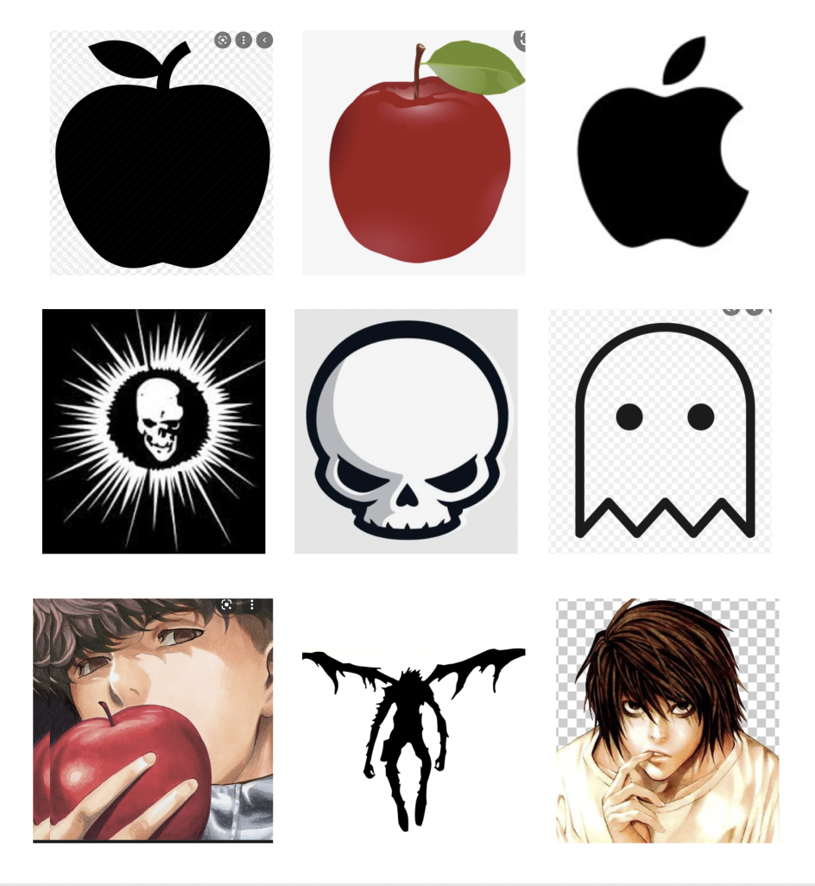

# dsgn270-a3
### Code journal
- This is the moodboard that I made during class.
- 
- I wanted to make an anime themed logo and after listing all of my favourite animes, death note was the easiest one to create.
- I made a demo version of this logo during the breakout activities but the pen tool was off so I remade it.
- With the old and not so nice design I experimented in figma by noticing which colors fit best.
- Since I wanted to stick with the original colors of the show I chose very basic colors but I changed the gradient of the red on css to a darker red.
- By the end of class I had ready the design of the logo, moodboard and the colors I just had to refix the design to look even and add the correct one in vscode.
- The color changing and css part was really easy to use, I didn't have any difficulties.